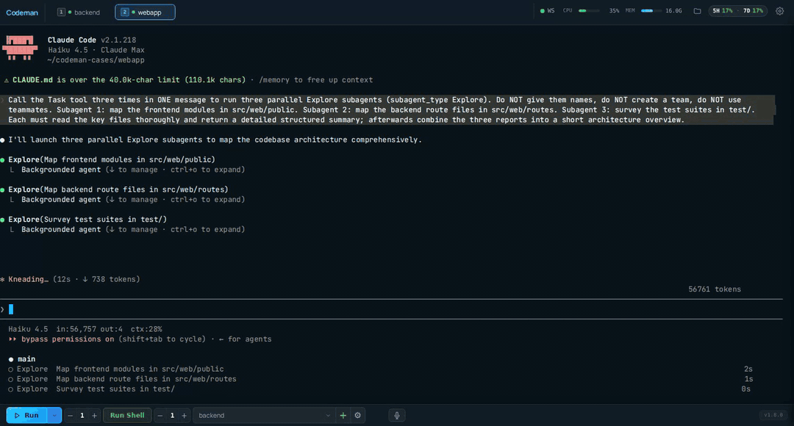
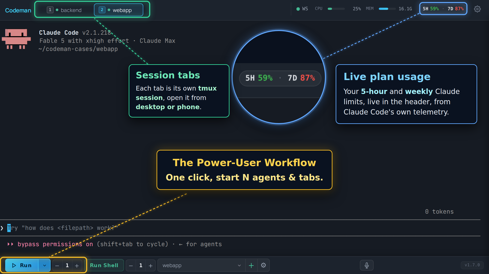
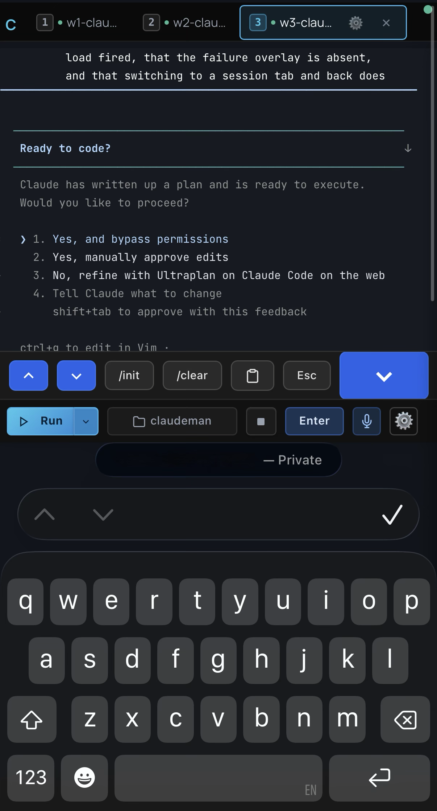
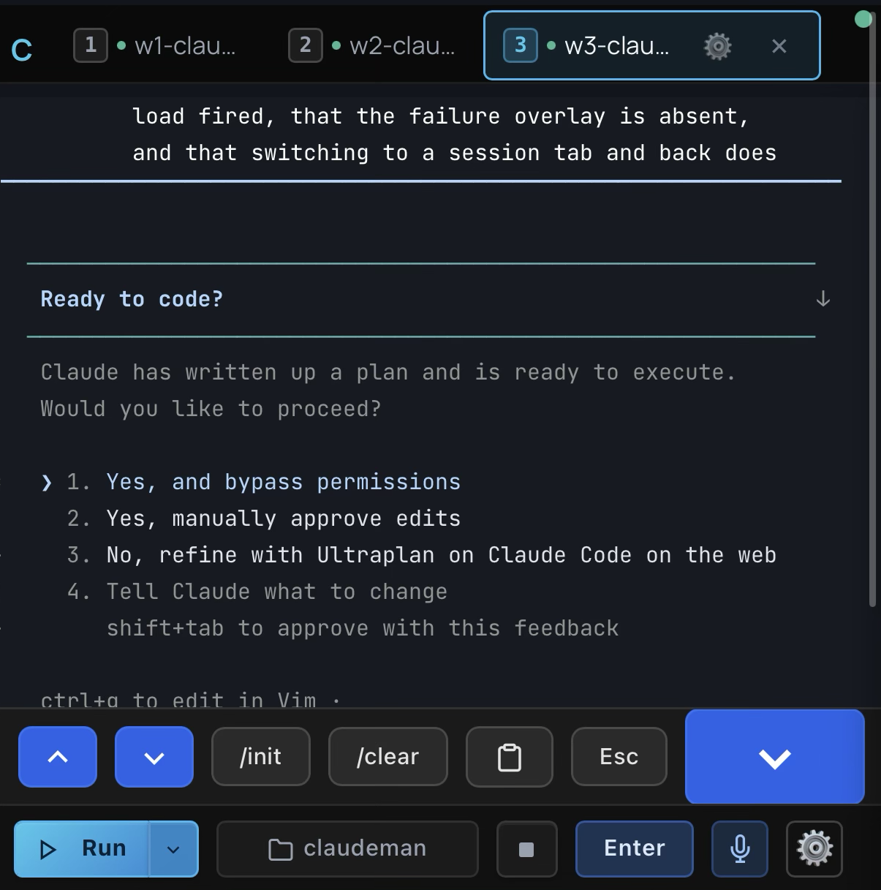
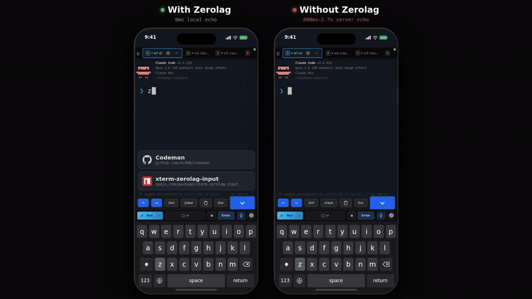
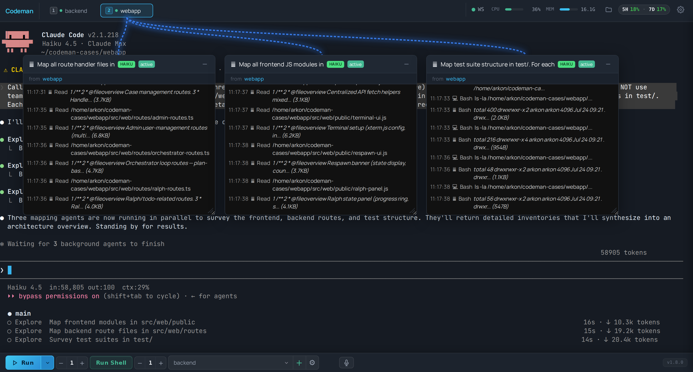
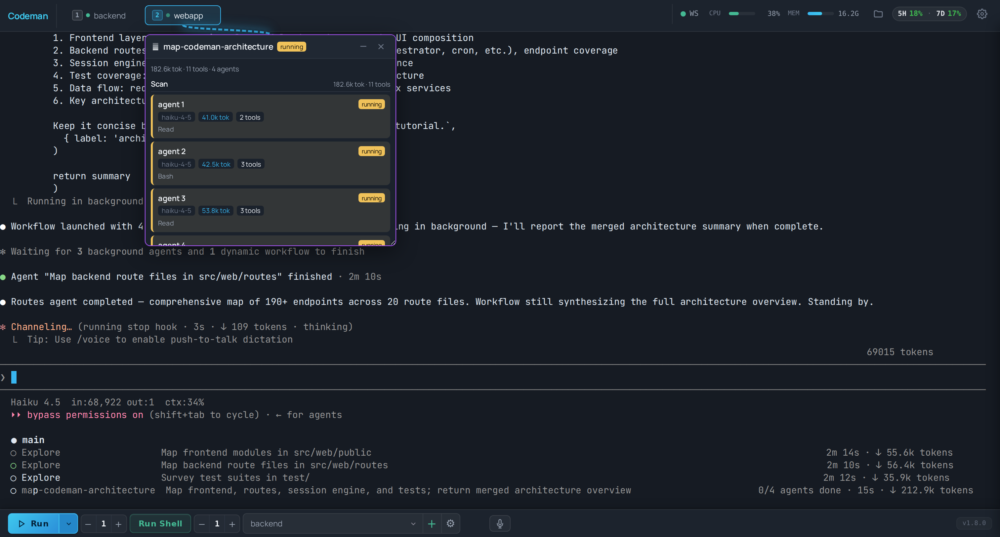
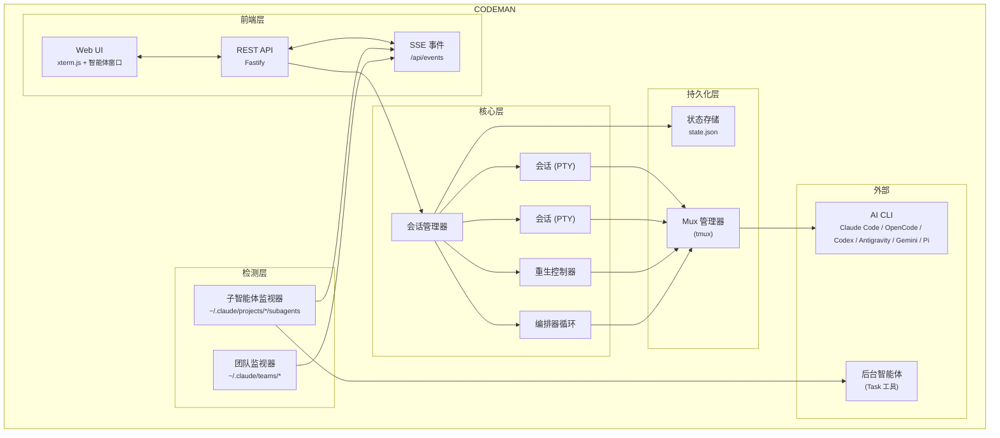

<p align="center">
  
</p>

<h2 align="center">AI 编程智能体的任务控制中心</h2>

<p align="center">
  <em>Claude Code &bull; OpenCode &bull; Codex &bull; Antigravity &bull; Gemini &bull; Pi &bull; Grok &bull; 终端 —— 统一仪表盘 &bull; 任意设备</em>
</p>

<p align="center">
  <a href="README.md">English</a> &bull; <strong>简体中文</strong>
</p>

<p align="center">
  <a href="https://opensource.org/licenses/MIT"></a>
  <a href="https://nodejs.org/"></a>
  <a href="https://www.typescriptlang.org/"></a>
  <a href="https://fastify.dev/"></a>
  <a href="https://github.com/Ark0N/Codeman/graphs/contributors"></a>
  <a href="https://github.com/Ark0N/Codeman/commits/master"></a>
</p>

<p align="center">
  
</p>

<p align="center">
  
</p>

> 本文档由英文版 [`README.md`](README.md) 翻译而来。如有出入，以英文版为准。

一行命令即可安装（macOS 和 Linux，Windows 通过 WSL）：

```bash
curl -fsSL https://getcodeman.com/install | bash
```

```bash
codeman web
# 打开 http://localhost:3000，开启你的第一个会话
```

安装器在每次系统改动前都会先询问；重跑同一条命令即可原地更新。详见[快速开始 — 安装](#快速开始--安装)。

---

## 快速开始 — 安装

```bash
curl -fsSL https://getcodeman.com/install | bash
```

该脚本会在缺失时自动安装 Node.js 和 tmux，把 Codeman 克隆到 `~/.codeman/app` 并完成构建。几点须知：

- **先询问，后改动。** 所有系统级改动（安装软件包、下载 AI CLI）都会先征求确认；结束时的菜单可选择：直接在本终端运行、安装为后台服务（systemd/launchd，开机自启），或暂不启动。不选就不会有任何后台进程。
- **重跑即更新。** 再次运行同一条命令即可原地更新已完成的安装：`~/.codeman/app` 中的本地改动会被 stash（绝不丢弃），运行中的服务会自动重启并校验。若首次安装中途失败，重跑会继续完成完整的安装流程。也可以使用 `install.sh update` 与 `install.sh uninstall`。
- **CI / 无终端环境：** 没有终端时，涉及系统改动的步骤会带着说明中止，而不是静默执行；在自动化场景设置 `CODEMAN_NONINTERACTIVE=1` 即可批准这些步骤。

你至少需要安装一个 AI 编程 CLI —— [Claude Code](https://docs.anthropic.com/en/docs/claude-code)、[OpenCode](https://opencode.ai)、[Codex](https://developers.openai.com/codex/cli)、[Antigravity](https://antigravity.google)、[Gemini CLI](https://github.com/google-gemini/gemini-cli)、[Pi](https://pi.dev)、[Grok Build](https://github.com/xai-org/grok-build)、[DeepSeek Harness](https://github.com/deepseek-ai/deepseek-harness) 或 [OMP](https://github.com/can1357/oh-my-pi)（任意组合均可；自 Google 面向消费者停售后，Gemini CLI 仅限企业版，Antigravity 是其继任者）。安装器会自动检测这九个中已安装的任意一个；若一个都没有，会提供安装 Claude Code 或 OpenCode 的选项，也可以选择跳过、稍后自行安装。安装完成后：

```bash
codeman web
# 打开 http://localhost:3000，开启你的第一个会话
```

**想和小团队共用一台？** 改用多用户模式启动：每人拥有自己的登录与工作空间。

```bash
codeman users add alice --admin      # 创建第一个管理员账号
codeman web --multiuser              # 命名登录 + 按用户隔离的案例空间
```

详见下文[多用户模式](#多用户模式可选启用)。

<details>
<summary><strong>作为后台服务运行</strong></summary>

安装器结尾的菜单（选项 2）可以帮你完成这一步，并在宣告成功前校验服务确实已启动。如需手动配置：

**Linux（systemd）：**

```bash
mkdir -p ~/.config/systemd/user
cat > ~/.config/systemd/user/codeman-web.service << EOF
[Unit]
Description=Codeman Web Server
After=network.target

[Service]
Type=simple
ExecStart=$(which node) $HOME/.codeman/app/dist/index.js web
Restart=always
RestartSec=10

[Install]
WantedBy=default.target
EOF
systemctl --user daemon-reload
systemctl --user enable --now codeman-web
loginctl enable-linger $USER
```

**macOS（launchd）：**

```bash
mkdir -p ~/Library/LaunchAgents
cat > ~/Library/LaunchAgents/com.codeman.web.plist << EOF
<?xml version="1.0" encoding="UTF-8"?>
<!DOCTYPE plist PUBLIC "-//Apple//DTD PLIST 1.0//EN"
  "http://www.apple.com/DTDs/PropertyList-1.0.dtd">
<plist version="1.0">
<dict>
  <key>Label</key>
  <string>com.codeman.web</string>
  <key>ProgramArguments</key>
  <array>
    <string>$(which node)</string>
    <string>$HOME/.codeman/app/dist/index.js</string>
    <string>web</string>
  </array>
  <key>RunAtLoad</key><true/>
  <key>KeepAlive</key><true/>
  <key>StandardOutPath</key>
  <string>/tmp/codeman.log</string>
  <key>StandardErrorPath</key>
  <string>/tmp/codeman.log</string>
</dict>
</plist>
EOF
launchctl bootstrap gui/$(id -u) ~/Library/LaunchAgents/com.codeman.web.plist
```

</details>

<details>
<summary><strong>Windows（WSL）</strong></summary>

```powershell
wsl bash -c "curl -fsSL https://getcodeman.com/install | bash"
```

Codeman 依赖 tmux，因此 Windows 用户需要 [WSL](https://learn.microsoft.com/en-us/windows/wsl/install)。如果还没装 WSL：在管理员 PowerShell 中运行 `wsl --install`，重启，打开 Ubuntu，然后在 WSL 内安装你偏好的 AI 编程 CLI（[Claude Code](https://docs.anthropic.com/en/docs/claude-code)、[OpenCode](https://opencode.ai)、[Codex](https://developers.openai.com/codex/cli)、[Antigravity](https://antigravity.google)、[Gemini CLI](https://github.com/google-gemini/gemini-cli)、[Pi](https://pi.dev)、[Grok Build](https://github.com/xai-org/grok-build)、[DeepSeek Harness](https://github.com/deepseek-ai/deepseek-harness) 或 [OMP](https://github.com/can1357/oh-my-pi)）。安装完成后，即可从 Windows 浏览器访问 `http://localhost:3000`。

</details>

---

## 移动端优化的 Web UI

在任意手机上都能获得最跟手的 AI 编程智能体体验。完整的 xterm.js 终端、本地回显、滑动导航，以及为真正的远程办公而设计的触控优化界面 —— 而不是把桌面 UI 硬塞进小屏幕。

<table>
<tr>
<td align="center" width="40%"></td>
<td align="center" width="60%"></td>
</tr>
<tr>
<td align="center"><em>触控回答提示</em></td>
<td align="center"><em>配件栏 + 独立 Enter 按钮</em></td>
</tr>
</table>

<table>
<tr>
<th>普通终端 App</th>
<th>Codeman 移动端</th>
</tr>
<tr><td>远程输入延迟 200–300 毫秒</td><td><b>本地回显 —— 即时反馈</b></td></tr>
<tr><td>字小、无上下文</td><td>完整 xterm.js 终端</td></tr>
<tr><td>无会话管理</td><td>滑动切换会话</td></tr>
<tr><td>无通知</td><td>审批 / 空闲时推送提醒</td></tr>
<tr><td>需手动重连</td><td>tmux 持久化</td></tr>
<tr><td>看不到智能体</td><td>实时查看后台智能体</td></tr>
<tr><td>斜杠命令靠复制粘贴</td><td>一键 <code>/init</code>、<code>/clear</code>、<code>/compact</code></td></tr>
<tr><td>在手机上手打密码</td><td><b>扫二维码 —— 即时认证</b></td></tr>
</table>

- **键盘配件栏** —— 在虚拟键盘上方提供 `/init`、`/clear`、`/compact` 快捷按钮；破坏性命令需双击确认，绝不误触
- **独立的 Enter 按钮** —— 以按键方式回放，先冲刷本地回显缓冲的文本，不会让内容滞留在屏幕上
- **滑动导航与智能键盘处理** —— 左右滑动切换会话；键盘弹出时工具栏与终端整体上移（`visualViewport` API）
- **为手机而生** —— 刘海与 Home 指示条的安全区适配、44px 触控目标、底部抽屉式 case 选择器、原生惯性滚动

```bash
codeman web --https
# 在手机上打开：https://<你的IP>:3000
```

> `localhost` 走纯 HTTP 即可。从其他设备访问时请使用 `--https`，或使用 [Tailscale](https://tailscale.com/)（推荐）—— 它提供私有网络，让你无需 TLS 证书即可从手机访问 `http://<tailscale-ip>:3000`。

### 安全的二维码认证

在手机键盘上输密码太痛苦了。Codeman 用**密码学安全的一次性二维码令牌**取而代之 —— 扫描桌面上显示的二维码，手机即刻完成认证。

每个二维码编码的是一个包含 6 字符短码的 URL，该短码在服务端映射到一个 256 位密钥（`crypto.randomBytes(32)`）。令牌每 **60 秒**自动轮换，**首次扫描即原子性消费**（重放永远失败），并采用**基于哈希的 `Map.get()` 查找**，不会通过响应时延泄露任何信息。短码只是一个不透明指针 —— 真正的密钥永远不会出现在浏览器历史、`Referer` 头或 Cloudflare 边缘日志中。

该安全设计覆盖了 ["Demystifying the (In)Security of QR Code-based Login"](https://www.usenix.org/conference/usenixsecurity25/presentation/zhang-xin)（USENIX Security 2025，该研究发现 Top-100 网站中有 47 个存在漏洞）所指出的全部 6 个关键二维码认证缺陷：强制一次性使用、短 TTL、密码学随机性、服务端生成、扫描时桌面实时通知（QRLjacking 检测），以及 IP + User-Agent 会话绑定与手动吊销。双层速率限制（按 IP + 全局）使得在 62^6 = 568 亿种可能短码空间内进行暴力破解变得不可行。完整安全分析见：[`docs/qr-auth-plan.md`](docs/qr-auth-plan.md)

---

## 使用 Codeman —— 人类操作指南

从头到尾走一遍如何在浏览器里驾驭 Codeman。如果你刚装好，就从这里开始。

### 1. 启动服务器

```bash
codeman web                       # localhost:3000（仅环回 —— 安全默认值）
codeman web --port 8080           # 自定义端口（或设置 CODEMAN_PORT）
codeman web --https               # 自签名 TLS（仅远程访问时需要）
codeman web -H 0.0.0.0            # 绑定局域网 —— 必须设置 CODEMAN_PASSWORD（见「安全」）
```

打开打印出的 URL。整个页面是一个单一仪表盘；下面的一切都在这里完成。

### 2. 创建你的第一个会话

点击 **+ New Session**（或 **Quick Start**）。一个会话就是一个运行在自己 tmux 终端里的 AI CLI。你可以选择：

| 字段                   | 作用                                                                                        |
| ---------------------- | ------------------------------------------------------------------------------------------- |
| **工作目录 / case**    | 智能体操作的文件夹。「case」就是一个 Codeman 记住的命名工作目录。                           |
| **CLI / 运行模式**     | `Claude`（默认）、`OpenCode`、`Codex`、`Antigravity`、`Gemini`、`Pi`、`Grok` 或 `Terminal`（普通 shell）。 |
| **模型**               | 每会话模型（App Settings → Claude Model）。软默认值 —— 会话内 `/model` 依然有效。           |
| **Effort / Ultracode** | 推理力度（`low`–`max`），或用 `ultracode` 开启动态多智能体工作流。随时可用 `/effort` 切换。 |

点击启动 —— Codeman 通过真实 PTY 拉起 CLI，并经 SSE 流式传输到你的浏览器。

### 3. 读懂仪表盘

- **标签（顶部）** —— 每个会话一个。`Alt+1`–`9` 跳转，`Ctrl+Tab` 下一个，拖拽排序（标签顺序会跨设备同步）。
- **终端（中央）** —— 真实的 `xterm.js` 终端；完整 TUI 正常渲染。直接输入并按 **Enter** 发送。`Shift+Enter` 插入换行。
- **侧边面板** —— Respawn、Orchestrator、Cron、Subagents、Settings（从工具栏切换）。

### 4. 与智能体对话

- **直接在终端输入提示** —— 即使跨越重连，输入也是精确一次送达（连接中断绝不会丢失或重复发送提示）。
- **粘贴或拖放图片**，直接进入会话。
- **语音输入** —— `Ctrl+Shift+V`（Deepgram Nova-3，自动静音停止）。
- **附件** —— 注册外部文件/文档，并内联预览 Office/PDF。

### 5. 让它自主运行

| 模式             | 用途                                                                                                      | 位置                                                               |
| ---------------- | --------------------------------------------------------------------------------------------------------- | ------------------------------------------------------------------ |
| **Respawn**      | 长时间无人值守运行 —— 空闲/限额时自动重启 CLI，带自适应时序。预设：`solo-work`、`overnight-autonomous` 等 | Respawn 标签页                                                     |
| **Orchestrator** | 把一个目标变成分阶段计划，并跨多个智能体推动完成。                                                        | 编排器面板                                                         |
| **Cron**         | 已保存的、命名的定时任务（`once`/`interval`/`daily`/`weekly`），到期时拉起会话并发送提示。                | ⏰ Cron 按钮（可选启用：App Settings → Display → Header Displays） |
| **Auto-resume**  | 订阅限额重置后自动继续。                                                                                  | Respawn 标签页（顶部）                                             |

### 6. 随时随地访问

- **手机/平板** —— UI 完全触控优化；扫描桌面上的**二维码**即可免密码登录。
- **网络之外** —— `./scripts/tunnel.sh start` 打开一条 Cloudflare 隧道（先设置 `CODEMAN_PASSWORD`）。
- **SSH** —— `codeman tui` 是终端里的全屏会话面板（`codeman tui --list` 列出，`codeman tui 2` 直接附着到某个会话）。

### 7. 运维与维护

- **App Settings** —— 模型、effort、权限启动模式、主题/皮肤、通知、显示开关、各 CLI 的专属选项，以及跨设备同步的自定义显示名称和按设备保存的英文/简体中文界面语言。
- **自更新** —— git-clone 安装可在 **Settings → Updates** 中原地更新。
- **部署你自己的改动** —— 见[开发](#开发)。

> ⚠️ **安全提示：** 如果你正在 Codeman 受管会话*内部*工作（`echo $CODEMAN_MUX` → `1`），绝不要直接运行 `tmux kill-session` / `pkill claude` —— 请使用 Web UI 或 `./scripts/tmux-manager.sh`。

---

## 零延迟输入叠加层

<p align="center">
  
</p>

远程访问你的编程智能体时（VPN、Tailscale、SSH 隧道），每次按键通常需要 200–300 毫秒往返。Codeman 实现了一套**受 Mosh 启发的本地回显系统**，无论延迟多高，打字都感觉即时。

xterm.js 内部一个像素级精准的 DOM 叠加层以 0ms 渲染按键。后台转发会以 50ms 防抖批次静默地把每个字符送往 PTY，因此 Tab 补全、`Ctrl+R` 历史搜索以及所有 shell 特性都正常工作。当服务端回显在 200–300ms 后到达时，叠加层无缝消失、真实终端文本接管 —— 整个切换过程不可见。

- **抗 Ink 架构** —— 它作为 `.xterm-screen` 内 z-index 7 的一个 `<span>` 存在，完全不受 Ink 持续重绘屏幕的影响（此前两次使用 `terminal.write()` 的尝试都失败了，因为 Ink 会破坏注入的缓冲区内容）
- **字体匹配渲染** —— 从 xterm.js 的计算样式读取 `fontFamily`、`fontSize`、`fontWeight` 与 `letterSpacing`，使叠加层文本与真实终端输出在视觉上无法区分
- **完整编辑** —— 退格、重打、粘贴（多字符）、光标跟踪，输入超过终端宽度时多行换行
- **重连后持久** —— 未发送的输入通过 localStorage 在页面刷新后保留
- **默认启用** —— 桌面端与移动端均可用，会话空闲或繁忙时都生效

> 已抽取为独立库：[`xterm-zerolag-input`](https://www.npmjs.com/package/xterm-zerolag-input) —— 见[已发布的包](#已发布的包)。

---

## 实时智能体可视化

实时观看后台智能体工作。Codeman 监控智能体活动，将每个智能体显示在一个可拖拽的浮动窗口中，并用「黑客帝国」风格的动态连接线连回父会话。

<p align="center">
  
</p>

- **浮动终端窗口** —— 每个智能体一个可拖拽、可调整大小的面板，带实时活动日志，逐条展示每一次工具调用、文件读取与进度更新
- **连接线** —— 用动态绿色线条连接父会话与其子智能体，随智能体的产生与完成实时更新
- **状态与模型徽标** —— 绿色（活动）、黄色（空闲）、蓝色（已完成）指示，并以 Haiku/Sonnet/Opus 的颜色编码区分模型
- **自动行为** —— 窗口在产生时自动打开、完成时自动最小化，标签徽标显示「AGENT」或「AGENTS (n)」计数
- **嵌套智能体** —— 支持 3 层层级（主会话 → 团队成员智能体 → 子-子智能体）

多智能体 Workflow 运行（「ultracode」）同样可视化：一个浮动运行窗口实时跟踪整个工作流，展示阶段、各智能体的 token 用量与当前工具：

<p align="center">
  
</p>

**智能体团队（Agent Teams）** —— 一等公民式支持 Claude Code 原生的多智能体团队（`CLAUDE_CODE_EXPERIMENTAL_AGENT_TEAMS=1`）。`TeamWatcher` 轮询 `~/.claude/teams/`，将团队成员匹配到其主会话，并以实时子智能体窗口呈现，且具备**团队感知的空闲检测** —— 因此当团队成员仍在工作时，重生控制器不会被触发。详见 [`docs/agent-teams/`](docs/agent-teams/)。

---

## 重生控制器（Respawn Controller）

自主工作的核心。当智能体进入空闲，重生控制器会检测到，发送继续提示，循环执行上下文管理命令以获得全新上下文，然后恢复工作 —— 可完全无人值守运行 **24 小时以上**。

```
WATCHING → IDLE DETECTED → SEND UPDATE → /clear → /init → CONTINUE → WATCHING
```

- **多层空闲检测** —— 完成消息、AI 驱动的空闲检查、输出静默、token 稳定性
- **用量限额自动恢复**（_可选，默认关闭_）—— 当 Claude 因订阅用量限额而停止（"You've hit your limit · resets 3pm"）时，Codeman 会解析重置时间，等到限额刷新（外加 2 分钟安全缓冲）后自动关闭限额对话框并发送 `continue`，让通宵任务平稳跨过 5 小时窗口而不是停摆到早晨。可识别 Claude Code 各版本的全部限额消息格式；若仍受限会自动重试；计划在 Codeman 重启后依然生效；暂停期间会阻止重生循环，避免 `/clear` 清掉等待中的对话。在会话 Respawn 标签页顶部按会话启用
- **熔断器** —— 当 Claude 卡住时防止重生抖动（CLOSED → HALF_OPEN → OPEN 状态，跟踪连续无进展与重复错误）
- **健康评分** —— 0–100 健康分，分项涵盖循环成功率、熔断器状态、迭代进展与卡死恢复
- **内置预设** —— `solo-work`（3s 空闲，60min）、`subagent-workflow`（45s，240min）、`team-lead`（90s，480min）、`ralph-todo`（8s，480min）、`overnight-autonomous`（10s，480min）

---

## 编排器循环（Orchestrator Loop）

超越单会话重生，**编排器**把一个高层目标转化为分阶段计划，并跨多个智能体推动其完成 —— 这是一个运行 `idle → planning → approval → executing → verifying → (replanning) → completed` 的状态机。

- **先规划，后执行** —— 从你的目标生成分阶段计划，并在动手前暂停等待审批；可带反馈拒绝以重新生成
- **逐阶段验证关卡** —— 每个阶段在下一阶段开始前都会被验证；失败时编排器会重新规划而非一头扎下去
- **多智能体执行** —— 将各阶段分发给团队智能体 / 任务队列，协调超出单会话能力的工作
- **崩溃安全** —— 完整状态持久化在 `state.json` 的 `orchestrator` 键下，可在重启后存续
- **可从 UI 或 API 驱动** —— 编排器面板，或 `POST /api/orchestrator/start` → `/approve` → `/status`（共 10 个端点）

> 完整设计：[`docs/orchestrator-loop-architecture.md`](docs/orchestrator-loop-architecture.md)。

---

## 多会话仪表盘

运行 **20 个并行会话**且全程可见 —— 60fps 的实时 xterm.js 终端、按会话的 token 与成本跟踪、基于标签的导航，以及一键管理。

### 持久化会话

每个会话都运行在 **tmux** 内 —— 会话可在服务器重启、网络中断与机器休眠后存续。启动时自动恢复，具备双重冗余。幽灵会话发现机制能找到孤立的 tmux 会话。受管会话带有环境标签，因此智能体不会杀掉自己的会话。

### 会话管理器与命令面板

`Ctrl/Cmd/Alt+K` 打开模糊搜索的会话面板；**Browse all sessions** 打开会话管理器：一份去重后的完整清单，涵盖 Codeman 所知的一切（活动会话、来自状态与生命周期历史的既往会话，以及 Claude 转录），每一行都显示其第一条与最近一条提示。

- **置顶（Pin）**：把会话固定到列表顶部。被置顶的会话甚至能挺过被杀掉（降级为一条轻量的已停止记录，依然可见、可恢复）。
- **名称保留**：从会话管理器恢复既往会话时保留其原有名称，而不是生成一个新名称。
- **跨设备标签顺序**：拖拽排序的标签顺序保存在服务端，你的排列会从桌面跟随到手机。

### 主机名感知的窗口标题

在多台主机上运行 Codeman（笔记本、开发机、NAS）？浏览器标签标题是 `codeman:<主机名>`，让你无需点进去就能分辨每个标签对应哪个后端：

```bash
codeman web                                # codeman:<os.hostname()>
codeman web --title-hostname dev-box       # codeman:dev-box（用于覆盖嘈杂的主机名）
```

标题在首字节时就被模板化进所提供的 HTML 中，因此从第一帧绘制起就是正确的，且无需 JavaScript 也能工作。同样的主机名前缀也应用于标签闪烁格式（`⚠️ (N) codeman:<host>`）和操作系统级桌面通知（`codeman:<host>: <事件>`），让系统通知中心里的跨主机提醒也不再含糊。

### 智能 Token 管理

| 阈值            | 动作            | 结果                   |
| --------------- | --------------- | ---------------------- |
| **110k tokens** | 自动 `/compact` | 上下文被摘要，工作继续 |
| **140k tokens** | 自动 `/clear`   | 以 `/init` 全新开始    |

### 通知

当会话需要关注时实时桌面提醒 —— `permission_prompt` 与 `elicitation_dialog` 触发关键的红色标签闪烁，`idle_prompt` 触发黄色闪烁。点击任意通知即可直接跳转到相关会话。Hook 按 case 目录自动配置。

### 运行摘要（Run Summary）

点击任意会话标签上的图表图标，即可看到所发生一切的时间线 —— 重生周期、token 里程碑、自动 compact 触发、空闲/工作切换、hook 事件、错误等等。

### 零闪烁终端

基于终端的 AI 智能体（Claude Code 的 Ink、OpenCode 的 Bubble Tea）会在每次状态变更时重绘屏幕。Codeman 实现了一套 6 层抗闪烁流水线，让所有会话都获得平滑的 60fps 输出：

```
PTY 输出 → 16ms 服务端批处理 → DEC 2026 包裹 → SSE → 客户端 rAF → xterm.js（60fps）
```

---

## 更多特性

- **自更新** —— systemd/launchd 管理下的 git-clone 安装可在 **App Settings → Updates** 中原地更新：它会检测最新发行版，自动暂存（stash）脏工作树，并在服务重启期间流式展示构建进度（npm 安装会被报告为不可更新）
- **多 CLI** —— 每个会话可选 **Claude Code**、**OpenCode**、**Codex**、**Antigravity**、**Gemini**、**Pi** 或 **Grok**；环境变量前缀自动隔离（`CLAUDE_CODE_*`、`OPENCODE_*`、`CODEX_*`、`ANTIGRAVITY_*`、`PI_*`、`GROK_*`/`XAI_*` 与 `GEMINI_*`/`GOOGLE_*`）。详见 [`docs/opencode-integration.md`](docs/opencode-integration.md)、[`docs/pi-integration.md`](docs/pi-integration.md) 与 [`docs/grok-integration.md`](docs/grok-integration.md)
- **Docker 会话** —— 在隔离且加固的容器中运行案例。**Create New** 上勾选一个复选框即可用合理的默认值启动容器并在其中启动智能体；同一案例的多个会话共享一个容器；可将容器连同工作区导出为可移植的 `.tar.gz`，迁移到另一台机器。详见 [`docs/docker-cases.md`](docs/docker-cases.md)
- **远程 SSH 会话**：把案例指向另一台机器，让智能体在那里一个持久的远程 tmux 中运行：SSH 断连不中断任务、自动重连，还能发现并附着主机上已在运行的会话。详见 [`docs/remote-sessions.md`](docs/remote-sessions.md)
- **Effort 与 Ultracode** —— 设置每会话的默认 effort（`low`–`max`），或启用 **ultracode**（动态多智能体工作流）。这些都只是软默认值 —— 会话中可随时用 `/effort` 切换。扩展思考预算也可配置
- **语音输入** —— 用 Deepgram Nova-3 口述提示（带 Web Speech API 回退）：切换录音、自动静音停止、实时音量表（`Ctrl+Shift+V`）
- **图像输入** —— 直接把图片粘贴或拖放进会话
- **手势控制** _(可选)_ —— 一个 MediaPipe 手部追踪叠加层，可徒手抓取/拖动会话窗口并捏合按钮。用 `CODEMAN_GESTURE=1` + App Settings → Display 启用
- **多显示器横跨** _(macOS)_ —— 一键打开一个横跨所有显示器最大化的浏览器窗口，让浮动的智能体/手势面板可以跨越物理拼接缝
- **文件查看器按钮** _(可选)_ —— 头部新增一个按钮，一键切换内置文件浏览器面板；在 App Settings → Display → Header Displays 中启用
- **CJK / 输入法支持** —— 完整支持中文 / 日文 / 韩文的组合输入
- **操作系统通知与主机名感知标题** —— 桌面提醒与标签标题以 `codeman:<host>` 为前缀，使多主机配置不再含糊

---

## 隔离的 Docker 会话

让案例（case）运行在专属的加固 Docker 容器里，而不是直接跑在主机上：获得安全隔离、可复现的工具链和一键可移植性。

- **一键启动** —— 在 **New Case → Create New** 中勾选 **🐳 Run in an isolated Docker container**。Codeman 会创建案例文件夹、用默认设置启动容器，并在容器内启动智能体。无需填写任何主机/镜像/网络字段。
- **资源模板** —— 展开复选框可选 **Small / Medium / Large / GPU** 预设（内存、CPU、GPU），也可以完全自定义。**磁盘是弹性的** —— 存储随数据增长，没有固定上限。
- **按案例共享容器** —— 多个会话可以 `docker exec` 进同一个容器；结束某个会话绝不会影响其他会话所在的容器。
- **默认加固** —— 非 root、`--cap-drop ALL`、`no-new-privileges`、PID/内存上限，绝不使用 `--privileged` 或 docker socket；**密封（sealed）** 配置（不注入主机凭据、关闭网络）只需一个开关。
- **无感认证、凭据隔离** —— 主机上的 Claude / Codex / Antigravity / Gemini / OpenCode / Pi 登录在容器内开箱即用：凭据在启动时以只读种子方式复制注入，onboarding/信任提示已预先答复，不会弹出登录向导。容器保留自己的副本，绝不回写主机的凭据存储；跨边界共享的只有对话转录，导出文件也绝不包含机密。
- **迁移到另一台机器** —— 把容器的完整环境（工具链 + 工作区）导出为可移植的 `.tar.gz`，在另一台机器上导入到新案例即可继续。
- **持久耐用** —— Codeman 重启后重连会回到同一个存活的智能体；容器停止/重启后则从绑定挂载的转录恢复对话。

前置条件：只需 Docker（或 Podman）。智能体基础镜像会在首次使用时自动构建，构建进度实时显示在 UI 中（也可用 `node scripts/build-agent-image.mjs` 预构建）。完整指南：[`docs/docker-cases.md`](docs/docker-cases.md)。

---

## 远程 SSH 会话

把案例（case）指向另一台机器，通过 SSH 让智能体**在那台机器上**运行，同时保留同样的仪表盘、移动端 UI 与自主运行特性。你的笔记本只是一扇窗口，会话本体活在远程主机上。

- **天生持久**：智能体运行在远程主机上一个专用的 tmux 会话里，SSH 断连、网络切换或笔记本休眠都不会中断任务。重新连接后回到同一个活跃对话。
- **自动重连**：一个带上限退避的监视器发现 SSH 面板断开后，会静默重新附着到仍在运行的远程会话（设置中有总开关；主动杀掉的会话绝不会被复活）。
- **发现与附着**：列出主机上已在运行的 `codeman-*` 会话（由那台机器自己的 Codeman 或其他操作者启动）并附着其一。非你所有的已附着会话在关闭标签时**只分离，绝不杀掉**。
- **共享会话**：多个客户端可以以不同窗口尺寸同时附着同一个远程会话而互不挤压；发现列表会显示带客户端计数的「shared」徽标。
- **注入安全**：所有 ssh 命令行都经由单一的 shell 转义构建器生成，主机/路径/身份文件字段均有模式校验。

在 **New Case → Remote** 中配置（主机、用户、身份文件、可选跳板机）。完整设计：[`docs/remote-sessions.md`](docs/remote-sessions.md)。

---

## 多用户模式（可选启用）

与一个小型互信团队共享同一个 Codeman，每人拥有自己的登录与工作空间。**默认关闭**：不加该开关时，行为与单用户完全一致。

用 `codeman web --multiuser`（或 `CODEMAN_MULTIUSER=1`）启用。创建第一个管理员后，可通过 CLI 或 App Settings 中的 **Users** 标签页管理用户：

```bash
codeman users add alice --admin      # 提示输入密码（或 --password-stdin）
codeman users add bob                # 普通用户
codeman users list
```

- **按用户的空间**：每个用户的案例位于 `~/codeman-users/<name>/cases`；会话、案例、搜索与实时事件都按属主隔离。管理员可以看到全部。
- **可单独吊销的登录**：命名用户的密码以 scrypt 哈希保存在 `~/.codeman/users.json`；可随时禁用、重置（一次性密码）或删除账号。管理员操作审计记录在 `~/.codeman/admin-audit.jsonl`。
- **普通用户的更安全默认值**：非管理员以 `--permission-mode auto` 运行 Claude（Anthropic 的分类器护栏模式）；raw shell 会话、cron `launchCommand` 与跳过权限模式需要按用户显式授权。

> ⚠️ **这只是工作空间的划分，不是用户之间的沙箱。** 所有会话都以同一个操作系统账户运行，因此有心用户的智能体依然能触及他人的文件。若需要真正的隔离，请结合 **Docker 案例**，或在不同的操作系统账户下运行独立实例。参见 [`docs/multi-user-plan.md`](docs/multi-user-plan.md) 与 [`docs/security-architecture.md`](docs/security-architecture.md) 的多用户章节。

---

## 远程访问 —— Cloudflare 隧道

使用免费的 [Cloudflare 快速隧道](https://developers.cloudflare.com/cloudflare-one/connections/connect-networks/do-more-with-tunnels/trycloudflare/)，从手机或本地网络外的任意设备访问 Codeman —— 无需端口转发、无需 DNS、无需静态 IP。

```
浏览器（手机/平板）→ Cloudflare 边缘（HTTPS）→ cloudflared → localhost:3000
```

**前置条件：** 安装 [`cloudflared`](https://developers.cloudflare.com/cloudflare-one/connections/connect-networks/downloads/) 并在环境中设置 `CODEMAN_PASSWORD`。

```bash
# 快速开始
./scripts/tunnel.sh start      # 启动隧道，打印公网 URL
./scripts/tunnel.sh url        # 显示当前 URL
./scripts/tunnel.sh stop       # 停止隧道
./scripts/tunnel.sh status     # 服务状态 + URL
```

脚本会在首次运行时自动安装一个 systemd 用户服务。隧道 URL 是一个随机生成的 `*.trycloudflare.com` 地址，每次隧道重启都会改变。

<details>
<summary><strong>持久隧道（重启后存续）</strong></summary>

```bash
# 启用为持久服务
systemctl --user enable codeman-tunnel
loginctl enable-linger $USER

# 或通过 Codeman Web UI：Settings → Tunnel → 切换为开
```

</details>

<details>
<summary><strong>认证</strong></summary>

1. 首次请求 → 浏览器弹出 Basic Auth 提示（用户名：`admin` 或 `CODEMAN_USERNAME`）
2. 成功后 → 服务端签发 `codeman_session` cookie（24 小时 TTL，活动时自动延长）
3. 后续请求通过 cookie 静默认证
4. 同一 IP 失败 10 次 → 429 速率限制（15 分钟衰减）

通过隧道暴露前**务必设置 `CODEMAN_PASSWORD`** —— 否则任何拿到 URL 的人都能完全访问你的会话。

</details>

### 二维码认证

在手机键盘上输密码很糟糕。Codeman 用**短暂的一次性二维码令牌**解决这个问题 —— 扫描桌面上的二维码，手机即刻完成认证。无密码提示、无打字、无剪贴板。

```
桌面显示二维码  →  手机扫描  →  GET /q/Xk9mQ3  →  服务端校验
→  令牌原子性消费（一次性）  →  签发会话 cookie  →  302 跳转到 /
→  桌面收到通知：「设备已通过二维码认证」  →  自动生成新二维码
```

只拿到裸隧道 URL（没有二维码）的人，仍会撞上标准密码提示。二维码是快速通道；密码是回退方案。

#### 工作原理

服务端维护一个轮换的、短生命周期、一次性令牌池。每个令牌由一个 256 位密钥（`crypto.randomBytes(32)`）和一个用作 URL 路径中不透明查找键的 6 字符 base62 短码配对组成。二维码编码的 URL 形如 `https://abc-xyz.trycloudflare.com/q/Xk9mQ3` —— 短码是指针，而非密钥本身，因此它绝不会通过浏览器历史、`Referer` 头或 Cloudflare 边缘日志泄露。

每 **60 秒**，服务端自动轮换到一个全新令牌。上一个令牌会保留 **90 秒的宽限期**，以处理你刚好在轮换瞬间扫描的竞争情况 —— 此后即作废。每个令牌都是**一次性**的：手机一旦成功扫描，令牌就被原子性消费，并立即为桌面显示生成一个新的。

#### 安全设计

该设计参考了 ["Demystifying the (In)Security of QR Code-based Login"](https://www.usenix.org/conference/usenixsecurity25/presentation/zhang-xin)（USENIX Security 2025），该研究发现 Top-100 网站中有 47 个因横跨 42 个 CVE 的 6 个关键设计缺陷而易受二维码认证攻击。Codeman 全部六个都做了应对：

| USENIX 缺陷                  | 缓解措施                                                                                      |
| ---------------------------- | --------------------------------------------------------------------------------------------- |
| **缺陷 1**：缺少一次性强制   | 令牌首次扫描即原子性消费 —— 重放永远失败                                                      |
| **缺陷 2**：长生命周期令牌   | 60s TTL + 90s 宽限，由定时器自动轮换                                                          |
| **缺陷 3**：可预测的令牌生成 | `crypto.randomBytes(32)` —— 256 位熵。短码采用拒绝采样以消除取模偏差                          |
| **缺陷 4**：客户端令牌生成   | 仅服务端 —— 令牌在嵌入二维码前绝不离开服务器                                                  |
| **缺陷 5**：缺少状态通知     | 桌面提示：_「设备 [IP] 已通过二维码认证（Safari）。不是你？[吊销]」_ —— 实时 QRLjacking 检测  |
| **缺陷 6**：会话绑定不足     | 存储 IP + User-Agent 以供审计。通过 API 手动吊销会话。HttpOnly + Secure + SameSite=lax cookie |

#### 时序安全的查找

短码存储在 `Map<shortCode, TokenRecord>` 中。校验使用 `Map.get()` —— 一个基于哈希的 O(1) 查找，不会通过响应时延泄露目标字符串的任何信息。热路径上任何地方都没有逐字符字符串比较，彻底消除了时序侧信道攻击。

#### 速率限制（双层）

二维码认证有自己的速率限制，与密码认证完全独立：

- **按 IP**：同一 IP 失败 10 次二维码尝试即触发 429 封锁（15 分钟衰减窗口）—— 与 Basic Auth 的失败计数器分开，因此打错密码不会消耗你的二维码额度
- **全局**：所有 IP 合计每分钟 30 次二维码尝试 —— 抵御分布式暴力破解。考虑到 62^6 = 568 亿种可能短码、任意时刻仅约 2 个有效，无论如何暴力破解都在计算上不可行

#### 二维码尺寸优化

URL 被刻意保持精简（`/q/` 路径 + 6 字符码 ≈ 53–56 个字符），以瞄准 **QR 版本 4**（33×33 模块）而非版本 5（37×37）。更小的二维码在低端手机上扫描更快 —— 现代设备读取版本 4 仅需 100–300 毫秒。`/q/` 前缀相比 `/qr-auth/` 省下 7 个字节，仅此一项就足以决定二维码版本的差别。

#### 桌面体验

二维码显示每 60 秒通过 SSE 自动刷新，SVG 直接嵌入事件载荷（约 2–5KB）—— 无需额外 HTTP 请求，刷新低于 50ms。倒计时器显示剩余时间。「重新生成」按钮可即时使所有现有令牌失效并创建一个新的（在你怀疑二维码被拍照时很有用）。

当有人通过二维码认证时，桌面会弹出一个带设备 IP 与浏览器信息的通知 —— 如果不是你，一键即可吊销所有会话。

#### 威胁覆盖

| 威胁                    | 为何无效                                                                             |
| ----------------------- | ------------------------------------------------------------------------------------ |
| **二维码截图被分享**    | 一次性：首次扫描即消费。60s TTL：攻击者动手前已过期。桌面通知会立即提醒你。          |
| **重放攻击**            | 原子性一次性消费 + 60s TTL。旧 URL 始终返回 401。                                    |
| **Cloudflare 边缘日志** | 短码是不透明的 6 字符查找键，而非真正的 256 位令牌。一次性意味着从日志重放永远失败。 |
| **暴力破解**            | 568 亿种组合、任意时刻约 2 个有效、双层速率限制，早在统计可行性之前就已拦截。        |
| **QRLjacking**          | 60s 轮换迫使实时转发。桌面提示提供即时检测。自托管单用户场景使钓鱼难以成立。         |
| **时序攻击**            | 基于哈希的 Map 查找 —— 无字符串比较时序泄露。                                        |
| **会话 cookie 窃取**    | HttpOnly + Secure + SameSite=lax + 24h TTL。可在 `POST /api/auth/revoke` 手动吊销。  |

#### 横向对比

| 平台             | 模型                                                                                   | 对比                                                                                                                                                     |
| ---------------- | -------------------------------------------------------------------------------------- | -------------------------------------------------------------------------------------------------------------------------------------------------------- |
| **Discord**      | 长生命周期令牌、无确认、[屡被利用](https://owasp.org/www-community/attacks/Qrljacking) | Codeman：一次性 + TTL + 通知                                                                                                                             |
| **WhatsApp Web** | 手机确认「关联设备？」，约 60s 轮换                                                    | 轮换相当；WhatsApp 额外加了显式确认（对单用户而言是可接受的取舍）                                                                                        |
| **Signal**       | 临时公钥、端到端加密信道                                                               | 加密更强，但 [2025 年仍被俄罗斯国家级行为者](https://cloud.google.com/blog/topics/threat-intelligence/russia-targeting-signal-messenger)通过社会工程攻破 |

> 完整设计理由、安全分析与实现细节：[`docs/qr-auth-plan.md`](docs/qr-auth-plan.md)

---

## 安全

Codeman 默认用 `--dangerously-skip-permissions` 启动会话，因此 Web UI 在设计上对任何能访问到它的人都是一个远程代码执行面 —— 整套安全模型的存在就是为了控制*谁*能访问。（启动权限模式可配置，见下文。）近期加固（v0.9.0 + v0.9.5）封堵了那些常困扰自托管开发工具的浏览器驱动攻击路径。完整模型：[`docs/security-architecture.md`](docs/security-architecture.md)。**发现了漏洞？** 私下披露方式与已知限制清单见 [`SECURITY.md`](.github/SECURITY.md)。

### 网络与访问

- **默认仅环回** —— 绑定 `127.0.0.1`，仅可从本机访问，因此「无密码」默认配置开箱即安全。在未设置 `CODEMAN_PASSWORD` 的情况下绑定非环回主机会*启动但打印一条醒目警告*，并给出三个具体修复方案（设置密码、环回 + 一个带认证的隧道，或用 `--allow-unauthenticated-network` 显式确认）
- **可选认证，真实会话** —— 通过 `CODEMAN_USERNAME`（默认 `admin`）/ `CODEMAN_PASSWORD` 的 HTTP Basic 认证。成功后签发一个不透明的 256 位 `codeman_session` cookie（`randomBytes(32)`）—— 服务端校验，而非客户端签名，因此无法离线伪造（24h TTL、自动延长、设备上下文审计日志）
- **按 IP 速率限制** —— 失败 10 次 → `429` 并带 `Retry-After`（15 分钟衰减）。即便攻击者在同一 IP 上猛攻，有效 cookie 或正确密码也能*立即*恢复 —— 这很重要，因为所有隧道流量共享同一个环回 IP。二维码认证有自己独立的限制器
- **可配置的权限模式**：`--dangerously-skip-permissions` 只是默认值。**App Settings → Claude CLI → Startup Mode** 可以把新会话切换为 Anthropic 的分类器护栏 `auto` 模式（低打扰，需要 Claude Code 2.1.207+）、`normal` 提示模式，或一份显式的允许工具列表。多用户模式下，未获授权的用户会被强制为 `auto`，shell 会话与跳过权限需要按用户显式授权

### 始终开启的浏览器加固（v0.9.5）

以下对**每个**请求都生效 —— 在认证之前，即便是默认的无密码环回安装：

- **Host 头允许列表 → 阻断 DNS 重绑定。** 一个被重绑定到 `127.0.0.1` 的自定义域名会在任何处理器运行前被 `403 host not allowed` 拒绝。允许：`localhost`、任意 IP 字面量、绑定主机、`.ts.net` / `.trycloudflare.com` / `.cfargotunnel.com`、当前受管隧道，以及 `CODEMAN_ALLOWED_HOSTS`（在此添加自定义反向代理域名 —— 逗号分隔；精确主机或前导点 `.suffix` 匹配子域名）
- **跨站 Origin / CSRF 防护。** 对变更状态的方法（`POST`/`PUT`/`PATCH`/`DELETE`），`Origin` 必须通过同一允许列表，否则返回 `403 cross-site request blocked`。*缺失*的 Origin 被允许（因此 `curl`、CLI 与 Claude Code hook 仍可工作）；只有存在但外来、或不透明的 `null` origin 才会被拒绝
- **原始 `text/plain` 请求体。** 全局解析器不再对 `text/plain` 做 JSON 解析，封堵了那个跨站 `fetch` 能在无预检的情况下把 JSON 走私进写路由的 CORS「简单请求」CSRF 向量
- **WebSocket Origin 校验。** 终端 WS 升级运行同样的 Host + Origin 检查，失败时以代码 `4003` 关闭（反 CSWSH）
- **XSS 转义的智能体输出。** AI 衍生的字符串（工具名、命令参数、子智能体描述）在渲染进子智能体 / 活动面板前，于每个注入点都做 HTML 转义

### 输入、文件与响应头

- **模式校验的输入** —— 每个 API 请求体都用 Zod v4 模式检查；一个 `CLAUDE_CODE_*` / `OPENCODE_*` / `CODEX_*` / `ANTIGRAVITY_*` / `GEMINI_*` / `GOOGLE_*` / `PI_*` 环境变量前缀允许列表把控每个 CLI 能接收哪些设置
- **路径限定** —— 文件路由在边界检查前先 `realpath`（无 TOCTOU）；`..`、绝对路径、以及解析到工作目录之外的符号链接都会被拒绝。上限：10 MB 文本预览 / 50 MB 原始与下载；`/api/download` 对敏感路径（`.env`、`*credentials*`、`~/.ssh/`、`.aws/credentials`）做黑名单。SVG/HTML 以 `octet-stream` + `nosniff` + attachment 提供，因此会被下载而非执行
- **安全响应头** —— `Content-Security-Policy`（`default-src 'self'`，每个例外都逐条列举）、`X-Content-Type-Options: nosniff`、`X-Frame-Options: SAMEORIGIN`、HTTPS 下的 HSTS，以及**仅**对 `localhost` / `127.0.0.1` / `::1` 反射的 CORS

### 供应链与隔离

- **锁定并校验的依赖** —— 安全敏感的传递依赖通过 npm `overrides` 强制为已打补丁版本；每次提交/PR 都检查锁文件完整性（所有条目都解析到 `registry.npmjs.org` 且带 `sha512` 哈希）。公共资源在 CI 中做 NUL 字节扫描与 `node --check` 校验
- **多实例隔离** —— `CODEMAN_INSTANCE` 同时限定 tmux 套接字（`-L codeman-<name>`）与数据目录（`~/.codeman-<name>`），因此两个实例绝不会互相附着对方的活动会话

> 移动端登录使用一次性、60 秒二维码令牌 —— 完整设计见上文[二维码认证](#二维码认证)（它应对了 USENIX Security 2025 二维码登录研究中的全部 6 个缺陷）。

---

## 键盘快捷键

> Ctrl 绑定在 macOS 上也接受 Cmd。

| 快捷键                          | 动作                                                     |
| ------------------------------- | -------------------------------------------------------- |
| `Ctrl/Cmd+W`                    | 杀掉当前会话                                             |
| `Ctrl/Cmd/Option+K`             | 查找已打开的会话或新建一个                               |
| `Ctrl/Cmd+Tab`                  | 下一个会话                                               |
| `Alt/Option+[` / `Alt/Option+]` | 上一个 / 下一个会话                                      |
| `Alt/Option+1`–`Alt/Option+9`   | 切换到第 N 个标签（按物理键位，macOS Option 布局也适用） |
| `Ctrl+Shift+{` / `Ctrl+Shift+}` | 将当前标签左移 / 右移                                    |
| `Ctrl/Cmd+C`                    | 复制选中内容；未选中时中断代理                           |
| `Ctrl+Shift+C`                  | 复制选中内容（永不中断）                                 |
| `Ctrl/Cmd+L`                    | 清屏                                                     |
| `Ctrl+Shift+R`                  | 恢复终端尺寸                                             |
| `Ctrl+Shift+V`                  | 切换语音输入                                             |
| `Ctrl/Cmd +` / `-`              | 字体大小                                                 |
| `Ctrl/Cmd+?`                    | 键盘帮助                                                 |
| `Shift+Enter`                   | 插入换行（发送到终端）                                   |
| `Escape`                        | 关闭面板与模态框                                         |

---

## 从智能体驱动 Codeman —— 编程指南

面向不经浏览器控制 Codeman 的 AI 智能体与自动化：一个拉起工作会话的智能体、一个 CI 机器人，或是**运行在 Codeman 会话*内部*、编排其他会话的 Claude Code**。UI 能做的一切都是 HTTP + CLI，因此智能体也能做。

> **捷径：装上打包好的智能体技能。** 下面这一整套（外加多工作会话的实战配方）已经作为 Claude Code 技能随仓库发布在 [`skills/codeman`](skills/codeman/SKILL.md)，会话内部的智能体不必等你把文档粘进提示词就能驱动 Codeman。三种获取方式：
>
> - `npx skills add Ark0N/Codeman --skill codeman -g`：全局安装，任何支持技能的智能体都能用
> - `codeman skill install`（全局）或 `codeman skill install --case <name>`：给那些从 npm 安装、从未克隆过仓库的用户；`codeman skill uninstall` 可撤销
> - **App Settings → Agent Skill**（`agentSkillEnabled`，默认关闭）：开启后，Codeman 会在每次于某个 case 中创建 Claude 会话时把技能注入该 case；case 里用户自己写的 `skills/codeman` 永远不会被覆盖
>
> 全局安装（`codeman skill install` 或 `npx skills add`）会被**本机每一个新建的 Claude Code 会话**读到，无论它在不在 Codeman 里。技能自带门禁：不在 Codeman 会话中（`CODEMAN_MUX` 未设置）时它拒绝动作，所以全局装上它对无关会话没有代价。
>
> ⚠️ 把 `agentSkillEnabled` 关回去**不会删掉已经注入的副本**（在创建时做清扫，会把技能从共用同一个 `.claude/` 目录的其他活动会话脚下抽走）。要删就按 case 删：`codeman skill uninstall --case <name>`。

### 检测自己身处 Codeman 内部

当 CLI 运行在 Codeman 受管会话中时，以下环境变量会被设置 —— 读取它们，别硬编码任何东西：

| 变量                       | 含义                                                                                                                 |
| -------------------------- | -------------------------------------------------------------------------------------------------------------------- |
| `CODEMAN_MUX=1`            | 你在一个受管 tmux 会话里。**绝不要** `tmux kill-session` / `pkill claude` / `pkill tmux` —— 你会杀掉自己或兄弟会话。 |
| `CODEMAN_API_URL`          | API 的基础 URL（例如 `https://127.0.0.1:3000`）。下面每个调用都用它。                                                |
| `CODEMAN_SESSION_ID`       | *你自己的*会话 id。用它避免对自己下手。                                                                              |
| `CODEMAN_HOOK_SECRET_FILE` | hook 密钥文件的路径（受管隧道开启时调用 `/api/hook-event` 必需）。                                                   |

### 行路规则（POST 之前先读）

1. **只发单行输入，而且必须以 `\r` 结尾。** 编程输入按字面文本发送，**只有当输入里含回车符时才会触发 Enter**：`{"input":"run tests\r"}`。少了 `\r`，文本就停在会话的输入框里不被提交（同一次调用里的 `wait` 还会在一个压根没开始的回合上耗满整个超时）。内嵌的换行会被剥掉而不是报错，因此 `"echo A\necho B\r"` 执行的是拼起来的 `echo Aecho B`：一次调用只发一行。
2. **让输入幂等。** 在 `POST …/input` 上带上稳定的 `clientId` 和按会话单调递增的 `seq`。服务端会去重，因此连接中断后的重试不会重复投递提示。
3. **认证。** 若设置了 `CODEMAN_PASSWORD`，发送 HTTP Basic 认证（用户 `admin` 或 `CODEMAN_USERNAME`）或 `codeman_session` cookie。默认的环回安装无密码。缺失的 `Origin` 头被允许，因此普通 `curl` 可用；跨站的浏览器 origin 会被拒绝（CSRF 防护）。⚠️ `401` 回的是裸字符串 `Unauthorized`，**不是** JSON 信封，直接喂给 `jq` 只会抛解析错误而看不到真正的失败原因：先看状态码，再解析。
4. **响应信封。** 多数端点返回 `{ "success": true, "data": … }`（错误：`{ "success": false, "error", "errorCode" }`）。少数遗留 GET 返回裸响应体 —— **两种都要处理**（`body.data ?? body`）。
5. **`/api/v1/*`** 是 `/api/*` 的稳定别名。
6. **用等待代替轮询，别把超时当成错误。** 等待类端点在没等到事情发生时也以 HTTP `200` 加 `wait.timedOut: true` 应答，所以要循环调用短等待（默认 60 秒），而不是发一个超长的调用：隧道会掐断空闲连接。`wait.timeoutMs` 告诉你服务端钳制之后真正采用的超时（上限 600 秒）。
7. **只有 `claude` 会话会发出 `stop` 与 `blocked`。** 这两个来自 Claude Code hook；`shell` 与外部 CLI（opencode/codex/gemini/antigravity/pi）只接受 `idle`、`working` 与 `exit`。在这些模式上显式索要 `stop` 会得到 `400`；不传 `until` 则永远安全。⚠️ `shell` 会话的 `idle` 只在启动时触发**一次**，此后再也不会，所以在那里用「发送并等待」只能等到超时：没有 hook 的会话请用 `wait-output` 标记来同步。
8. **没有任何东西会报告「就绪」，得自己显式等。** 新会话在 PID 出现之前一律回答 `{"signal":"exit","immediate":true}`（意思是*还没启动*，不是*崩了*），而全新 case 里的 `claude` 工作会话接着会停在 CLI 的信任对话框上。此时给它发提示，等待会在约 2 秒后因 `idle` 解除，看上去和一个跑完的回合一模一样，而文本其实卡在对话框里。下面的配方 2b 就是避开它的顺序。

### 常用配方

```bash
# 每个 Codeman 会话里都自动设好了 CODEMAN_API_URL，协议也是对的。
# 下面的兜底值适用于标准安装；在 --https 安装上请自己写 https:// 的地址，
# 并给每个 curl 加上 -k（自签名证书）。
API="${CODEMAN_API_URL:-http://127.0.0.1:3000}"
# （若设置了密码，给每个调用加上  -u admin:"$CODEMAN_PASSWORD"）

# 1. 看看有什么在运行
curl -s "$API/api/sessions" | jq '.data // .'

# 2. 拉起一个工作会话（「case」= 命名工作目录）
curl -s -X POST "$API/api/quick-start" \
  -H 'Content-Type: application/json' \
  -d '{"caseName":"refactor-auth","mode":"claude","effort":"high"}' | jq

# 2b. 等这个工作会话真正就绪（见规则 8）：先探输入框的标记，信任对话框只作兜底。
#     （反过来先探信任对话框、再盲发一个 Enter，在重复运行时会误伤：对话框的文字
#     会一直留在缓冲区里，探测因此匹配到旧文本，而那个 Enter 落进了已经就绪的输入框。）
#     匹配单个词：TUI 的文字到达匹配器时可能已经丢掉了词间空格。
until [ "$(curl -s "$API/api/sessions/$SID" | jq '.data.pid')" != null ]; do sleep 1; done
R=$(curl -sG "$API/api/sessions/$SID/wait-output" --data-urlencode 'match=bypass' \
      --data-urlencode 'from=buffer' --data-urlencode 'timeout=5000')
if ! jq -e '.data.wait.matched' <<<"$R" >/dev/null; then
  T=$(curl -sG "$API/api/sessions/$SID/wait-output" --data-urlencode 'match=trust' \
        --data-urlencode 'from=buffer' --data-urlencode 'timeout=2000')
  jq -e '.data.wait.matched' <<<"$T" >/dev/null && \
    curl -s -X POST "$API/api/sessions/$SID/input" -H 'Content-Type: application/json' \
      -d '{"input":"\r","useMux":true}'        # 接受首次运行的信任对话框
  curl -sG "$API/api/sessions/$SID/wait-output" --data-urlencode 'match=bypass' \
    --data-urlencode 'from=buffer' --data-urlencode 'timeout=45000' >/dev/null
fi

# 3. 向会话发送提示（精确一次：clientId + seq）
curl -s -X POST "$API/api/sessions/$SID/input" \
  -H 'Content-Type: application/json' \
  -d '{"input":"Run the test suite and summarize failures\r","useMux":true,"clientId":"agent-1","seq":1}'

# 4. 发送提示并阻塞到这一回合结束（先注册等待再写入，因此不会拿上一回合的状态来应答）
curl -s -X POST "$API/api/sessions/$SID/input" \
  -H 'Content-Type: application/json' \
  -d '{"input":"Run the test suite and summarize failures\r","useMux":true,
       "clientId":"agent-1","seq":2,"wait":"stop,exit","waitTimeout":60000}' \
  | jq '.data.wait'      # -> {"signal":"stop","timedOut":false,"waitedMs":41230,...}
#    （`stop` 是回合结束的权威 hook。加上 `idle` 会让它在转圈停顿时也解除，
#      任何重画出 ❯ 提示符的东西同理，比如一个对话框。）

# 4b. 超时了？那是 200，不是失败。循环调用短等待即可。
curl -s "$API/api/sessions/$SID/wait?until=stop,exit&timeout=60000" | jq '.data.wait'

# 4c. 或者等输出里出现某个标记（shell 会话也适用）。
#     ⚠️ 每次调用都要用不同的标记（tmux 重画会重放旧屏幕文字），并且把标记拆开写，
#     让敲进去的那一行本身不包含它：你自己的按键会回显进输出流，不拆开的标记会在
#     命令还没跑之前就匹配上。from=buffer 用来接住在等待落地之前就已打印的标记。
N=$RANDOM
curl -s -X POST "$API/api/sessions/$SID/input" -H 'Content-Type: application/json' \
  -d "{\"input\":\"M=DONE; npm test; echo \${M}_$N rc=\$?\r\",\"useMux\":true}"
curl -sG "$API/api/sessions/$SID/wait-output" \
  --data-urlencode "match=DONE_$N" --data-urlencode 'from=buffer' \
  --data-urlencode 'timeout=60000' | jq '.data.wait'

# 5. 读回答案。claude / codex 会话用 last-response：它取自 transcript 而不是屏幕，
#    因此不带 TUI 的画框与重画噪声。⚠️ 要轮询，别只读一次：transcript 落盘比 stop
#    信号稍晚，紧跟着「发送并等待」返回后立刻读，常常拿到空串。
for _ in $(seq 1 10); do
  TXT=$(curl -s "$API/api/sessions/$SID/last-response" | jq -r '.data.text')
  [ -n "$TXT" ] && break; sleep 1
done
printf '%s\n' "$TXT"

# 5b. 其他模式（shell/opencode/gemini/antigravity/pi）没有 transcript，读终端。
#     ⚠️ 用 terminal?tail=，不要用 /output：后者的 textOutput 对每个由 tmux 承载的
#     （也就是每个交互式）会话都是空的。tail 按字节计，返回的是含 ANSI 的终端数据。
curl -s "$API/api/sessions/$SID/terminal?tail=8000" | jq -r '.data.terminalBuffer'

# 6. 流式接收实时事件（会话输出、智能体活动、状态）
curl -sN "$API/api/events"          # Server-Sent Events

# 7. 调度周期性工作（cron 风格任务）
curl -s -X POST "$API/api/cron/jobs" \
  -H 'Content-Type: application/json' \
  -d '{"name":"nightly-deps","agentType":"claude","workingDir":"/home/me/proj",
       "promptMode":"inline_text","promptText":"Update dependencies and open a PR",
       "inputMode":"typed","scheduleType":"daily","dailyTime":"03:00",
       "enabled":true,"concurrencyPolicy":"warn_only"}' | jq

# 8. 查看后台子智能体及其活动记录
curl -s "$API/api/subagents" | jq '.data // .'
curl -s "$API/api/subagents/$AID/transcript" | jq -r '.data // .'

# 9. 全系统快照（会话、设置、重生、统计）
curl -s "$API/api/status" | jq
```

### 或使用内置 CLI

同样的操作也有命令形式（`codeman <cmd>`，括号内为别名）—— 在会话内的 shell 工具里很顺手：

```bash
codeman session start -d /path/to/repo   # (s)  启动会话
codeman session list                     #      列出会话
codeman session logs <id>                #      查看输出
codeman task add "fix the failing test"  # (t)  排入任务
codeman attach <path>                    #      附着 Claude hook 上下文
```

### Hook（事件*回流*到 Codeman）

Codeman 会注册 Claude Code hook，它们 `POST /api/hook-event`（`permission_prompt`、`idle_prompt`、`stop`、`task_completed` 等），让仪表盘实时响应。该端点在环回上免认证，但在受管隧道下需要 `X-Codeman-Hook-Secret` 头（从 `$CODEMAN_HOOK_SECRET_FILE` 读取）。通常你不需要手动调用它 —— Codeman 会自动接好 —— 但自主层正是靠它「看见」智能体在做什么。

> 完整端点列表与请求/响应形状见下文。

---

## API

基于 Fastify 的 REST —— **21 个路由模块中约 200 个处理器**，外加一条 SSE 流和一条 WebSocket 终端通道。所有响应都使用 `ApiResponse<T>` 信封（`{success, data}` / `{success, error, errorCode}`）；`/api/v1/*` 是稳定别名。以下是一个有代表性的子集：

### 会话（Sessions）

| 方法     | 端点                            | 说明                                                                                                                         |
| -------- | ------------------------------- | ---------------------------------------------------------------------------------------------------------------------------- |
| `GET`    | `/api/sessions`                 | 列出全部                                                                                                                     |
| `POST`   | `/api/quick-start`              | 创建 case + 启动会话（`{caseName?, mode?, effort?, envOverrides?}`）                                                         |
| `POST`   | `/api/sessions/:id/input`       | 发送输入（`{input, useMux?, clientId?, seq?, wait?, waitTimeout?}`：`clientId`+`seq` = 精确一次；`wait` 阻塞到这一回合结束） |
| `GET`    | `/api/sessions/:id/terminal`    | 读取终端输出（`?tail=<bytes>`、`?full=1`）：交互式会话的读取路径                                                             |
| `GET`    | `/api/sessions/:id/output`      | 一次性的解析输出（tmux 承载的会话里 `textOutput` 为空）                                                                      |
| `GET`    | `/api/sessions/:id/wait`        | 阻塞到某个信号触发（`?until=stop,idle,exit&timeout=&fresh=`）；超时是 `200`                                                  |
| `GET`    | `/api/sessions/:id/wait-output` | 阻塞到某个字面串出现（`?match=&nocase=&from=now\|buffer&timeout=`）                                                          |
| `GET`    | `/api/sessions/unified`         | 统一的活动 + 历史清单（会话管理器）：`?q=&limit=`                                                                            |
| `POST`   | `/api/sessions/:id/pin`         | 在会话管理器中置顶 / 取消置顶（`{pinned}`）                                                                                  |
| `PUT`    | `/api/session-order`            | 跨设备同步标签顺序（`{order: [ids]}`）                                                                                       |
| `DELETE` | `/api/sessions/:id`             | 删除会话                                                                                                                     |

### 重生（Respawn）

| 方法   | 端点                               | 说明                 |
| ------ | ---------------------------------- | -------------------- |
| `POST` | `/api/sessions/:id/respawn/enable` | 启用，带配置与定时器 |
| `POST` | `/api/sessions/:id/respawn/stop`   | 停止控制器           |
| `PUT`  | `/api/sessions/:id/respawn/config` | 更新配置             |

### 编排器（Orchestrator）

| 方法   | 端点                        | 说明            |
| ------ | --------------------------- | --------------- |
| `POST` | `/api/orchestrator/start`   | 从目标启动编排  |
| `POST` | `/api/orchestrator/approve` | 批准生成的计划  |
| `GET`  | `/api/orchestrator/status`  | 当前阶段 + 进度 |
| `POST` | `/api/orchestrator/stop`    | 停止并清理      |

### Cron（定时任务）

| 方法             | 端点                         | 说明                  |
| ---------------- | ---------------------------- | --------------------- |
| `GET` / `POST`   | `/api/cron/jobs`             | 列出 / 创建 cron 任务 |
| `PUT` / `DELETE` | `/api/cron/jobs/:id`         | 更新 / 删除任务       |
| `PUT`            | `/api/cron/jobs/:id/enabled` | 启用 / 禁用           |
| `POST`           | `/api/cron/jobs/:id/run`     | 立即运行              |
| `GET`            | `/api/cron/jobs/:id/runs`    | 运行历史              |

### 子智能体（Subagents）

| 方法     | 端点                            | 说明               |
| -------- | ------------------------------- | ------------------ |
| `GET`    | `/api/subagents`                | 列出所有后台智能体 |
| `GET`    | `/api/subagents/:id`            | 智能体信息与状态   |
| `GET`    | `/api/subagents/:id/transcript` | 完整活动记录       |
| `DELETE` | `/api/subagents/:id`            | 杀掉智能体进程     |

### 系统（System）

| 方法   | 端点                            | 说明                                     |
| ------ | ------------------------------- | ---------------------------------------- |
| `GET`  | `/api/events`                   | SSE 流                                   |
| `GET`  | `/api/status`                   | 完整应用状态                             |
| `POST` | `/api/hook-event`               | Hook 回调                                |
| `GET`  | `/api/system/update/check`      | 检查新发行版                             |
| `POST` | `/api/system/update`            | 自更新（git-clone 安装）                 |
| `POST` | `/api/clipboard`                | 把文本推送到所有已连接浏览器（`{text}`） |
| `GET`  | `/api/sessions/:id/run-summary` | 时间线 + 统计                            |

> **想在 Codeman 之上做集成？**[`docs/extending-codeman.md`](docs/extending-codeman.md)（英文）是集成指南：把你自己的界面作为标签页嵌入、订阅 SSE 事件流以便在 agent 需要你时做出响应、用脚本驱动 Codeman，以及动手前值得先了解的那些坑。Codeman 刻意不提供插件运行时，所以一个集成就是你自己的进程在讲 HTTP。

---

## 架构



---

## 开发

```bash
npm install
npx tsx src/index.ts web    # 开发模式
npm run build               # 生产构建
npm test                    # 运行测试（与 CI 相同；浏览器/移动端/性能套件另有独立命令）
```

完整文档见 [CLAUDE.md](./CLAUDE.md)。

---

## 代码库质量

本代码库经历了一次全面的 7 阶段重构，消除了上帝对象、集中了配置，并建立了模块化架构：

| 阶段             | 改了什么                                                                                                      | 影响                                       |
| ---------------- | ------------------------------------------------------------------------------------------------------------- | ------------------------------------------ |
| **性能**         | 缓存端点、SSE 自适应批处理、缓冲区分块                                                                        | 终端延迟低于 16ms                          |
| **路由抽取**     | `server.ts` 拆分为 15 个领域路由模块 + 认证中间件 + 端口接口                                                  | server.ts 代码量 **−67%**（6,736 → 2,254） |
| **领域拆分**     | `types.ts` → 16 个领域文件、`ralph-tracker` → 7 个文件、`respawn-controller` → 5 个文件、`session` → 6 个文件 | 不再有上帝文件                             |
| **前端模块**     | `app.js` → 18 个抽取模块，横跨基础设施、领域与特性层                                                          | app.js 核心降至 **约 3.4K 行**             |
| **配置合并**     | 约 70 个散落的魔法数字 → 10 个领域聚焦的配置文件                                                              | 零跨文件重复                               |
| **测试基础设施** | 共享 mock 库、12 个路由测试文件、统一的 MockSession                                                           | 路由处理器可通过 `app.inject()` 测试       |

完整细节：[`docs/archive/code-structure-findings.md`](docs/archive/code-structure-findings.md)

---

## 已发布的包

### [`xterm-zerolag-input`](https://www.npmjs.com/package/xterm-zerolag-input)

[](https://www.npmjs.com/package/xterm-zerolag-input)

为 xterm.js 提供即时按键反馈的叠加层。通过把输入的字符立即渲染为像素级精准的 DOM 叠加层，消除高 RTT 连接下的感知输入延迟。零依赖、可配置的提示符检测、带 78 个测试的完整状态机。

```bash
npm install xterm-zerolag-input
```

[完整文档](packages/xterm-zerolag-input/README.md)

---

## 版本策略

Codeman 遵循 [SemVer](https://semver.org/)。版本号真正承诺的内容，以及哪些算内部实现（HTTP/SSE API、磁盘上的状态、实验性特性），都写在 [`docs/versioning-policy.md`](docs/versioning-policy.md) 中。如果你的脚本依赖 HTTP API，请锁定到确切版本。

## 许可证

MIT —— 见 [LICENSE](LICENSE)

---

<p align="center">
  <strong>跟踪会话。可视化智能体。掌控重生。让它在你睡觉时持续运行。</strong>
</p>
